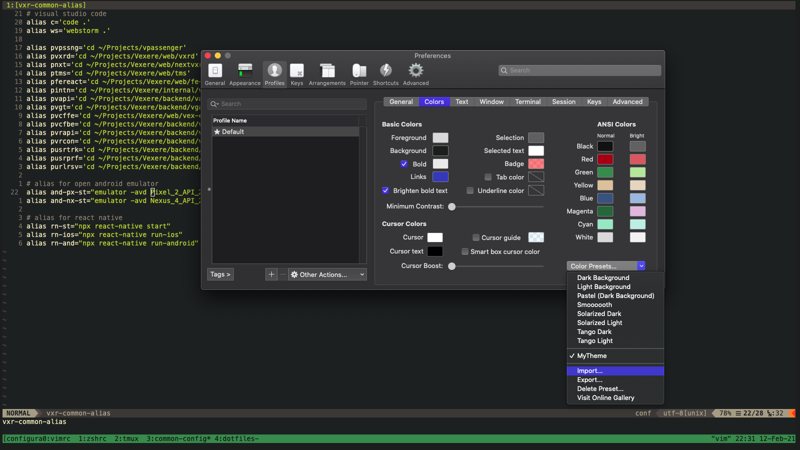

# HOANGO7604 CONFIGURATIONS

### DESCRIPTION
- This is my own dotfiles config.
- If there are new config files wanting to backup, add it's directory into Dotfiles line-by-line.
- *vimrc* is just for loading vim config files. The *real* vim config files is being stored in [hoango7604/vim-config](https://github.com/hoango7604/vim-config).

### PREREQUISITES

#### Install [Homebrew](https://brew.sh/):
```
/bin/bash -c "$(curl -fsSL https://raw.githubusercontent.com/Homebrew/install/HEAD/install.sh)"
```

#### Install [oh-my-zsh](https://github.com/ohmyzsh/ohmyzsh):
```
sh -c "$(curl -fsSL https://raw.githubusercontent.com/ohmyzsh/ohmyzsh/master/tools/install.sh)"
```
When the installation process is done, reload zsh by executing this command:
```
source ~/.zshrc
```
___
If you have trouble in reloading .zshrc, execute this command:
```
compaudit | xargs chmod g-w,o-w
```
___

#### Install zsh plugins: [zsh-autosuggestion](https://github.com/zsh-users/zsh-autosuggestions), [zsh-syntax-highlighting](https://github.com/zsh-users/zsh-syntax-highlighting), [zsh-completions](https://github.com/zsh-users/zsh-completions)
```
git clone https://github.com/zsh-users/zsh-autosuggestions ${ZSH_CUSTOM:-~/.oh-my-zsh/custom}/plugins/zsh-autosuggestions

git clone https://github.com/zsh-users/zsh-syntax-highlighting.git ${ZSH_CUSTOM:-~/.oh-my-zsh/custom}/plugins/zsh-syntax-highlighting

git clone https://github.com/zsh-users/zsh-completions ${ZSH_CUSTOM:=~/.oh-my-zsh/custom}/plugins/zsh-completions
```

#### Install zsh theme [powellevel10k](https://github.com/romkatv/powerlevel10k)
```
git clone --depth=1 https://github.com/romkatv/powerlevel10k.git ${ZSH_CUSTOM:-$HOME/.oh-my-zsh/custom}/themes/powerlevel10k
```

### INSTALLATION
Clone this project into $HOME/dotfiles directory and change directory into it:
```
git clone git@github.com:hoango7604/dotfiles.git ~/dotfiles
cd ~/dotfiles
```

Using *restore.sh* file to restore all your current configs to the backed up configs:
```
./restore.sh
```

### USAGE
- For backing up configs and push to repository: __*./backup.sh*__
- For pulling latest backed up configs and restoring configs: __*./restore.sh*__
    ___
    Notes:
- If you want to back up some other files/directories: place them on *Dotfiles* file (make sure they are not git projects)
- If you can't execute __*./backup.sh*__ or __*./restore.sh*__, make sure to execute: __*chmod +x ./backup.sh ./restore.sh*__
- If you are using iTerm2, you can use custom theme provided, which (in my opinion) suits the most with the vim 'gruvbox' theme:
    \<Command\> + ' , ' (Preferences) --> Profiles --> Colors --> Color Presets... --> Imports... --> (\<Command\> + \<Shift\> + ' . ' to show hidden files) --> Select ~/.iterm/themes/MyTheme.itermcolors
    
    
- To import profile to iTerm2: \<Command\> + ' , ' (Preferences) --> Profiles --> Other Actions... --> Import JSON Profiles... --> (\<Command\> + \<Shift\> + ' . ' to show hidden files) --> Select ~/.iterm/profile.json
- After reboot iTerm2, if terminal icons are missing, run command __*p10k configure*__ to install missing fonts. After reboot iTerm2 again, the missing icons are now rendered perfectly.
    ___

### OTHER CONFIG (AFTER RESTORED CONFIG)
#### Homebrew
All of my taps, formulaes and casks are stored on ~/Brewfile. For install all of them at once, execute this command:
```
brew bundle
```
___
Some already installed casks/Applications will show errors. It's OK, just ignore those errors. Or if you want to use Homebrew to manage all your installed casks/Applications, you could search for those installed in ~/Applications, remove those and run __*brew bundle*__ again
___

#### Tmux
My custom tmux configurations are placed on file *~/.tmux.conf*. All you need to do in order to use is to install package [Tmux Plugin Manager](https://github.com/tmux-plugins/tpm):
```
git clone https://github.com/tmux-plugins/tpm ~/.tmux/plugins/tpm
```
Reload Tmux to apply changes:
```
tmux source ~/.tmux.conf
```
Install tmux packages using Tmux Package Manager: prefix (\<Command\> + A) + I
___
Some configs requires *Meta* key for shortcut. You need to set Option keys (right + left Option) to make it works: \<Command\> + ' , ' (Preferences) --> Profiles --> Keys --> Tick Left Option Key and Right Option Key to value *Esc+*

___
